# Solution cms (WordPress) avec une architecture trois tiers  
**AUTOMATISATION** du déploiement avec **kubernetes rke2**

## 1. Introduction
Ce document présente un projet complètement automatisé du déploiement (mise en production/staging) d’une stack complète offrant une solution cms (WordPress) avec une architecture trois tiers (front, back,bdd) et une solution de supervision des services, via kubernetes k8s. Le cluster est constitué de cinq nœuds dont trois masters et deux workers, configurés automatiquement sur les instances ec2 avec le provider aws via ansible.  Afin de favoriser la flexibilité et la migration de ce projet, le cluster est configuré en mode **self-maged** en **haute disponibilité** et donc, n’est pas attaché à un provider "**X**". Les technologies utilisées dans la stack et les configurations peuvent-être facilement remplacées ou modifiées pour adapter le projet selon le besoin.  

**PS**:  
    Provieder actuel: **ASW**.

## 1.1 Pourquoi The Chosen ?

J’ai choisi ce projet car premièrement, il est constitué d’une stack des technologies très modernes. Aussi, après l’avoir créé et testé localement, puis sur le serveur “kourou” (serveur de test mis à disposition par l’école) avec github-action self-hosted, il m’est venu l’idée d’aller encore plus loin dans ma démarche et l’améliorer pour l’adapter à une infrastructure cloud notamment dans ses deux versions (D & K) qu’il présente. Cette  amélioration lui donne ainsi plusieurs aspects stratégiques et opérationnels.  

Dans l’aspect stratégique, The chosen assure une automatisation complète de la création des serveurs, du déploiement de l'infrastructure et de la mise en production d’une application (wordpress) sur le cloud AWS.
La sécurité dans ce projet est pensée sous forme de multicouches avec notamment les notions d’authentification avant d'accéder aux services, le cloisonnement des réseaux dans le compose.yml afin de restreindre la communication entre services et vers l’extérieure via un reverse-proxy en SSL, la gestion des conteneurs avec le stockage et la persistance des données, la création des instances ec2 dans le sous-réseaux du vpc pour le cluster rke2, la création des groupes de sécurités etc.  
The chosen offre aussi une solution de supervision utilisant les statistiques de l’environnement et des différents services, et peut-être facilement dupliqué pour offrir un environnement de test et/ou un déploiement blue-green.  

Quant à l’aspect opérationnel, les technologies sont éprouvées et modernes car la stack technologique de ce projet repose sur des outils fiables et bien intégrés (WordPress, MySQL, Traefik, etc…), minimisant les risques techniques et assurant une performance stable. Ces outils sont largement adoptés par la communauté (support), offrant un écosystème riche en ressources, plugins, et solutions aux éventuels problèmes.
Dans ces deux versions (Grâce à Docker avec l’orchestration des services via compose.yml et au cluster rke2 pour la haute disponibilité), le projet est  flexible, évolutif, migrable, modulable et facilement extensible. Cela permet d'adapter rapidement l'infrastructure aux besoins changeants.
Le projet suit une approche DevOps moderne dans ses deux facettes, optimisant les déploiements et la gestion des infrastructures.  

En combinant ces outils, il est possible de construire et de lancer le projet rapidement, notamment dans sa première version (D), ce qui est idéal pour répondre à des courtes échéances pour un budget moins conséquent. Mais  dans cette version, tous les services sont exposés en haute disponibilité via le cluster rke2 en 15 minutes (et en 10 minutes via la **version** [docker](https://github.com/thechosend01/thechosen1)).  
Que ce soit pour un usage personnel (individu) ou professionnel (groupe), ce projet allie robustesse, innovation et facilité de maintenance.

## 2. Prérequis:  
Pour faciliter une bonne prise en main de ce projet, il est recommandé d’avoir certaines connaissances et notions (avancées) sur kubernetes, et sur les outils annoncés dans les technologies utilisées. 

* *Matériels*: Terminal, éditeur de texte et navigateur web.

## 5. Technologies utilisées:  

**Ansible** : Configurations des serveurs distant  
**Terraform**: Créations automatique des ressources aws (+ccm)  
**Github actions** (workflows): CI/CD  
**Kubernetes**: Cluster rke2 de cinq noeuds  
**Kubectl**: pour la gestion du cluster à distance  
**kube-vip**: Ip virtuelle flottante pour la HA du cluster  
**OpenEbs**(C-stor): gestion automatique des volumes en HA  
**Helm**: Déploiement des applications (services)  
**ArgoCD**: pour la livraison continue  
**Grafana/Prometheus**: Supervision de l’infrastructure (monitoring)  
**WordPress** : CMS pour la création et la gestion de contenu.  
**MySQL** : Base de données relationnelle pour WordPress.  
**phpMyAdmin** : Interface web pour l'administration de MySQL.  
**SonarQube** : Outil d'analyse de la qualité du code.  
**PostgreSQL** : Base de données pour SonarQube.  
**Traefik** : Reverse-proxy et gestion SSL.  
**LetsEncrypt** (via Traefik) : Pour la gestion des certificats SSL.  
**Trivy**: Scanne la vulnérabilité du code via github action  
**Duckdns**: Outil open source pour la gestion de dns avec wildcard  (limité et idéal pour les tests)

## Schéma global du projet
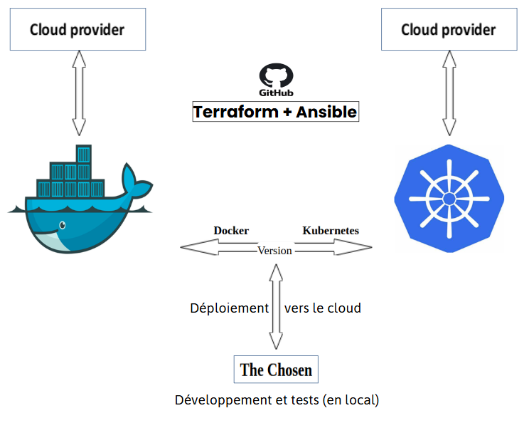  

## Schéma de l'architecture
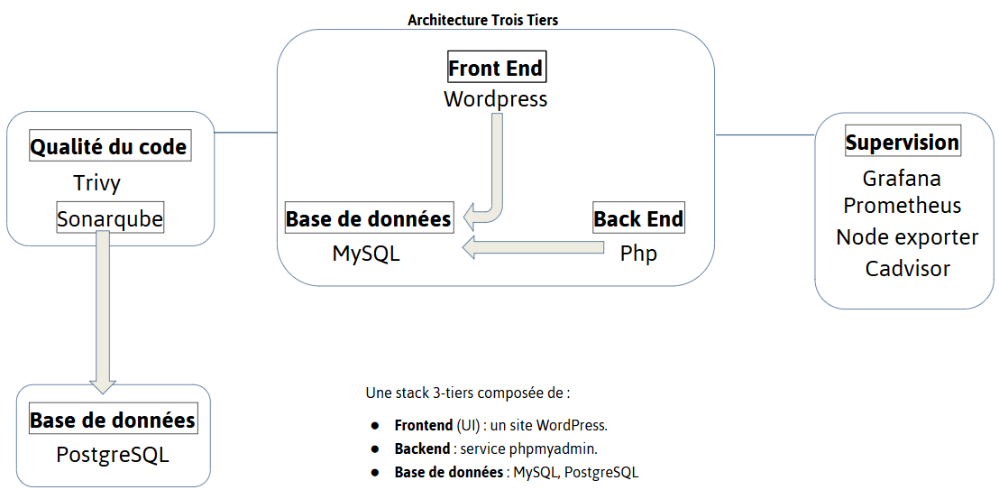  

## Schéma de l'automatisation (infra)
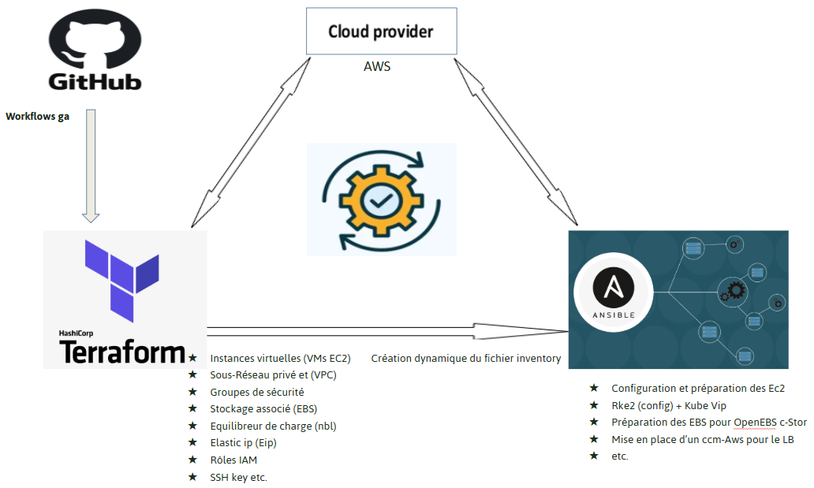

## 4. Schéma du projet rke2
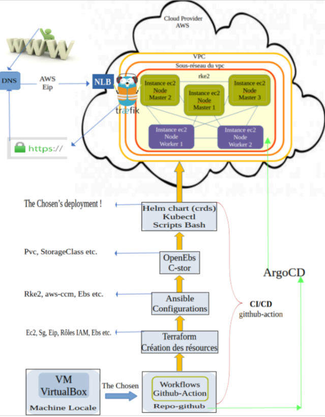  

## * Description du Schéma  (projet rke2)  

Le projet The Chosen est développé sur une machine virtuelle (VirtualBox) configurée sur  ma machine locale. Lors de son lancement, un push du projet vers le dépôt github déclenche automatiquement un workflow github-action qui lance l’initialisation de toute la configuration nécessaire et la mise en production (ci/cd).  

Après l’initialisation du workflow et l’installation des paquets nécessaires pour se faire, la première étape est la création des toutes les ressources via Terraform selon le provider (aws) et la configuration définit. Bien sûr, une configuration manuelle sur la définition des variables d’environnement (secrets, provider-credentials etc..) est nécessaire au préalable, dans le “repo” github.  

Une fois  toutes les ressources sont créées et disponibles, le workflow exécute ansible qui entame la configuration des composants et la mise en place du cluster kubernetes k8s, incluant des script Bash et des tests de validation.  
La configuration se poursuit avec l’installation d’OpenEbs (C-stor) directement via le workflow avec helm et ensuite, un déploiement complet du projet toujours via helm, avec une configuration manuelle des charts (crds) afin de garder la logique du cluster self-managed  et le contrôle totale sur le projet (versions, mises à jour etc..).  

Lorsque The Chosen est déployé dans le cluster ( sur le cloud), le reverse-proxy (load balancer) est lié à un nlb-aws créé automatiquement par le ccm-aws et qui lui, est aussi lié à son tour à une eip-aws vers laquelle pointe Duck-Dns (Nom de domaine). Ainsi, le reverse-proxy gère le routage vers les services selon leurs dns internes via des ingress Routes préalablement définis.  Ainsi, tous les services dans l’état “running”  dans le cluster deviennent accessibles depuis l'extérieur en https.  
Enfin, pour permettre la collaboration sur ce projet, The Chosen peut-être poussé sur un dépôt github d’une organisation créée en fonction, selon les besoins, avec un pull-request automatique lors du premier push créant une branche secondaire pour la mise à jour du projet via ArgoCD, après chaque validation “git merge” des nouvelles configurations poussées (par le dev-lead par exemple).  

## version K  

Dans cette version, le projet devient plus imposant avec sa haute disponibilité des services, gagne en fiabilité et en stabilité grâce à la définition des crds de chaque service via une helm chart avec values.yaml pour garder le contrôle total sur le projet et permettre la réplication des pods de services et des volumes dans le cluster. De même que dans sa première version, la création des toutes les ressources est effectuée avec terraform via un fichier main.tf qui crée aussi dynamiquement le fichier inventory dans le répertoire ansible_production, pour la configuration avec ansible. Grâce au playbook cette fois-ci, ansible assure automatiquement la configuration et la mise en place du cluster rke2, en installant toutes les dépendances nécessaires. OpenEbs-Cstor gère les volumes  persistantes partagées entre les nœuds via les PVCs et les storageclass pour  la résilience et la haute disponibilité. Un ccm-aws (Cloud Control Manager) est mise en place pour la gestion du nlb (Network Load Balancing) attaché à une eip-aws (Elastic IP) afin d’exposer automatiquement le service de type LoadBalancer (le reverse proxy traefik).
Lors d’un push vers la branche main, une pipeline ci/cd (workflow github-action) incluant quelques scripts bash déploie automatiquement les services vers le cluster rke2 via helm. Ce déploiement inclut la mise en place du contrôleur Kubernetes GitOps ArgoCD (Continuous Delivery) qui gère automatiquement la synchronisation des applications dans le cluster à partir du dépôt Git, pour favoriser la collaboration et la mise à jour automatique des nouvelles modifications du code.

 ## 5. Utilisation du projet
Il est essentiel de vérifier avant tout, le dossier ./helm_thechosen avec lequel, même sans modification de la configuration actuelle, les secrets et les variables doivent impérativement être configurés pour le bon fonctionnement de la stack.

## 5.1. Création des ressources avec Terraform  

Après avoir cloné le dépôt Git du projet et en supposant que vous avez déjà créé votre dépôt git pour ce projet, la première étape est de prendre connaissance du fichier main.tf dans le répertoire correspondant ./production_tf. Si vous utilisez un autre provider que AWS, il suffit d’adapter la configuration de ce fichier selon la documentation de votre provider. Sinon, vous n’avez rien à faire pour cette partie.  

**PS**:
Il est nécessaire de configurer vos credentials aws dans les variables et secrets de votre dépôt git que vous aurez créer sur github, dans settings -> secrets and variables. Ces variables doivent être définis tels que:  
secrets.AWS_ACCESS_KEY_ID, secrets.AWS_SECRET_ACCESS_KEY et  vars.AWS_DEFAULT_REGION.  Si vous décidez de les nommer autrement, pensez à modifier la tâche “name: Configurer AWS CLI” dans le fichier ./.github/workflows/aws_push.yml avec vos nouveaux noms de variables.

## 5.2. Configuration des services
Vous trouverez toutes les configurations dans le dossier ./helm_thechosen/*, pour la configuration et le déploiement via helm. Toute la configuration peut être adaptée selon le besoin.

## 5.3. Reverse-proxy et DNS
Ce projet utilise Traefik comme reverse proxy et duckdns pour l’enregistrement des noms de domaines. Les deux outils sont open source.
Créez un compte sur duckdns.org et enregistrez un nom de domaine. Celà génère automatiquement un token avec lequel, il faudra mettre à jour le DNS TOKEN dans les secrets ./helm_thechosen/traefik/templates/secret.yaml

**PS**:
Duckdns impose un préfixe dns.duckdns.org. Vous pouvez éviter celà en utilisant un fournisseur dns adapté comme CloudFlare et dans ce cas, pensez à adapter la configuration de traefik et mettre à jour le fichier secret.yaml

## 5.4. Configuration avec ansible
Le dossier ./ansible_production contient les configurations et les tâches  nécessaires pour configurer et installer automatiquement les dépendances nécessaires, ainsi que  la mise en place du cluster rke2.

## 6. Déploiement
Après avoir vérifié et adapté les configurations selon le besoin, pousser le projet vers la branche main de votre dépôt git et la ci/cd va se déclencher automatiquement pour lancer l'exécution des différents fichiers des configurations, afin de déployer les services. Accédez ensuite à vos services selon le DNS configuré pour chaque service.

**PS**:  
Au vu de la configuration et des outils utilisés, ce projet est idéale pour un "**Blue/Green** *Deployment*".

## 7. Vérifications via Bastion

7.1. **pods**:  
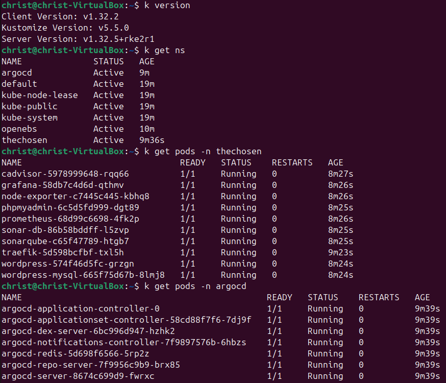  

7.2. **Nodes-k8s**:  
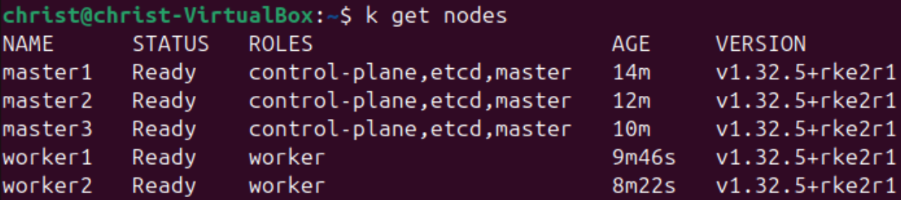  

7.3. **OpenEbs**:  
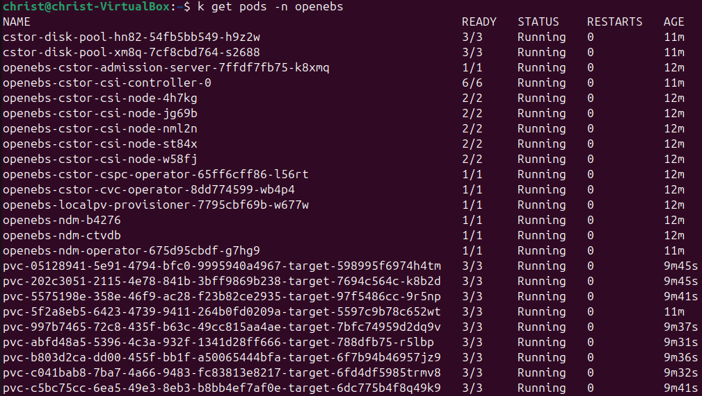  

7.4. **Services the_chosen**:  
    *Traefik + nlb + eip*  
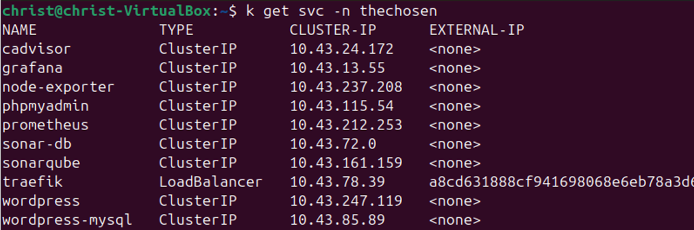 

7.4. **Services ArgoCD**:  
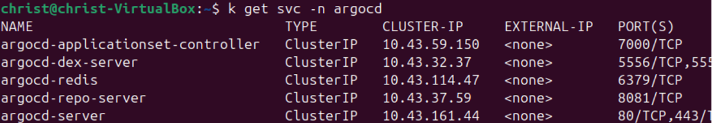 

## 8. Résultats du projet  

8.1. **Wordpress-config**:  
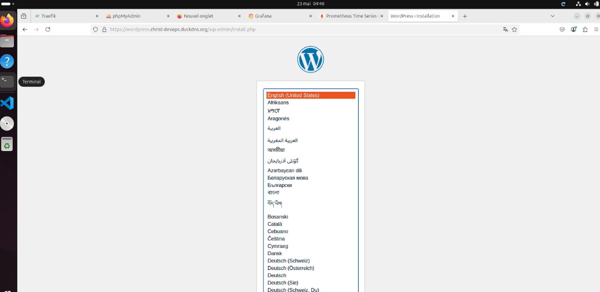  

8.2. **Site Wordpress**:
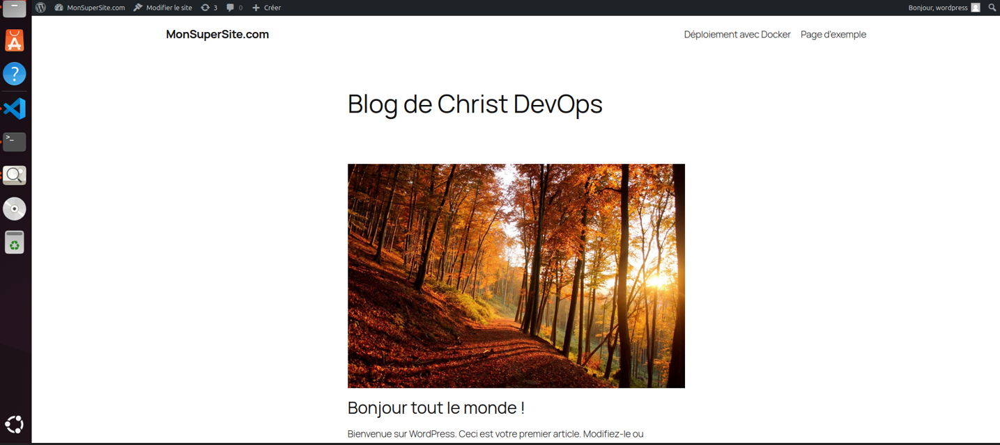  

8.3. **Traefik**:
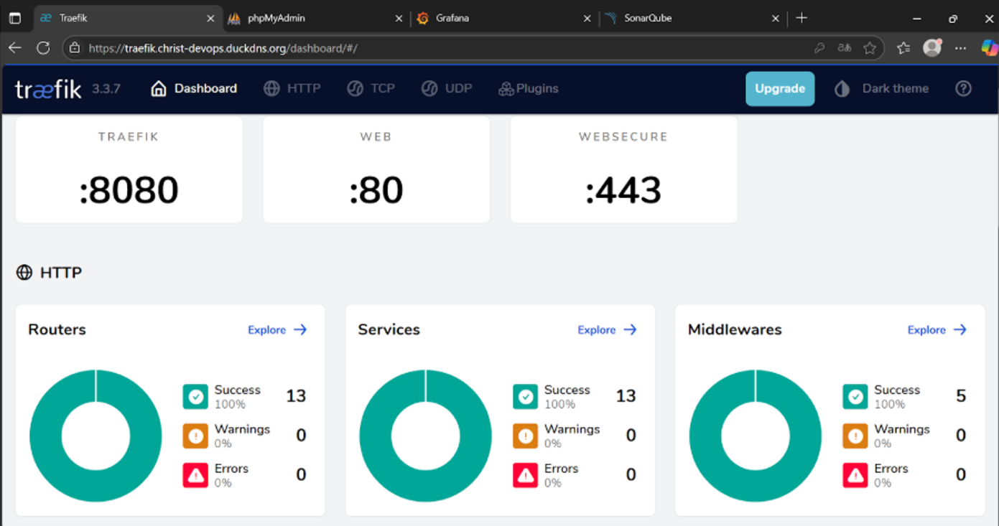  

8.4. **Traefik - Kubernetes crds**:  
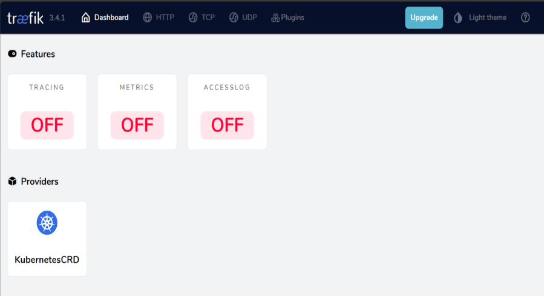  

Comme l'indiquent les résultats et les badges ci-dessus, le déploiement rke2 est un **succès**!!!  

**PS**
    Lors de l'exécution du workflow "aws_push.yml", une tâtche est chargée de récupérer **la clé ssh** "*vockeyprod.pem*" créée automatiquement par terraform et la sauvegarder dans les artifacts. Cette clé est utile pour acceder au serveur distant et au cluster rke2 pour récupérer et configurer le fichier "**/etc/rancher/rke2/rke2.yaml**" avec la kube-vip. (Bastion doit être dans le même sous-réseau du vpc-aws, ou configurer un VPN).  
    Supprimer immédiatement la *vockeyprod.pem* après sa récupération dans les artifacts!

**Fin du déploiement !!!**